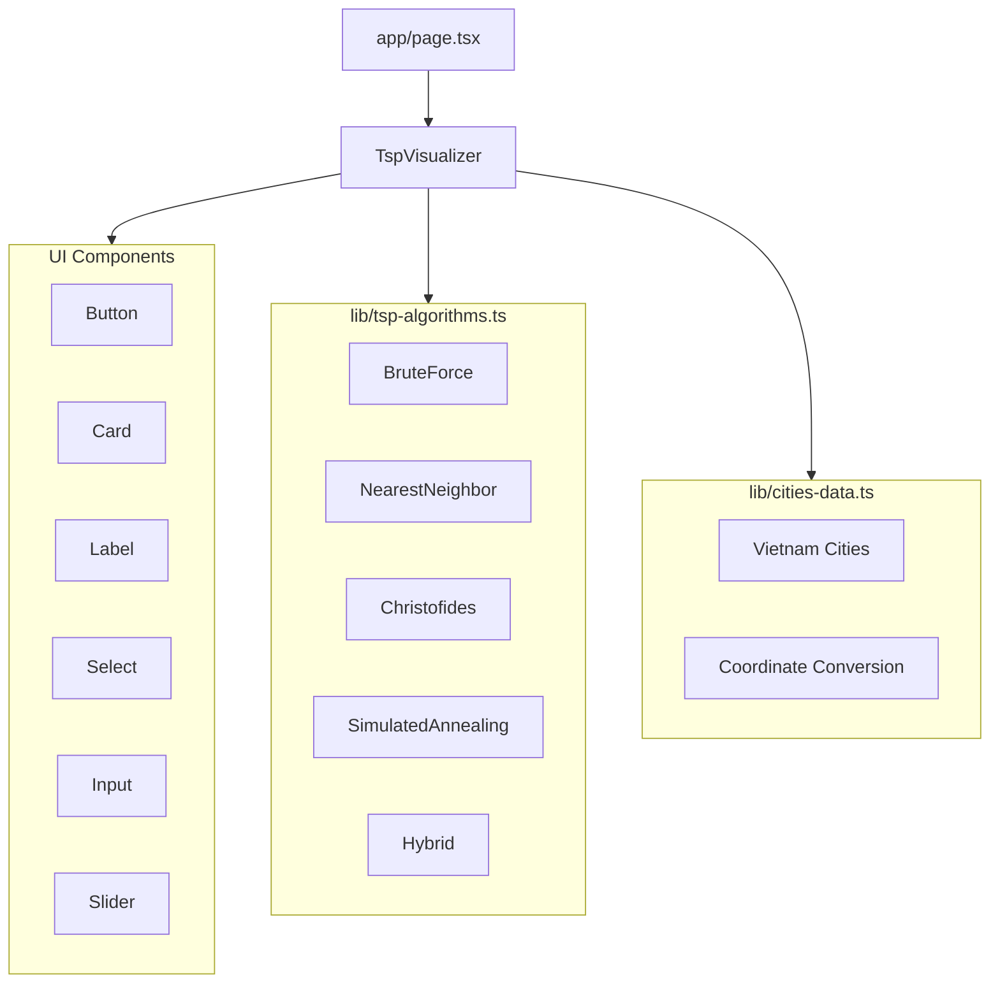

# TSP Visualizer System Patterns

## System Architecture

### Component Structure


### Core Components

1. **TspVisualizer Component**
   - Main orchestrator component
   - Manages state and user interactions
   - Controls canvas rendering
   - Handles algorithm execution
   - Manages history and statistics

2. **Algorithm Implementation**
   - Modular algorithm definitions
   - Common interface for all algorithms
   - Progress callback support
   - Async execution pattern
   - Parameter customization

3. **Data Management**
   - Centralized data structures
   - Coordinate system handling
   - Geographic data conversion
   - Point management utilities

## Design Patterns

### State Management
1. **Component State**
   ```typescript
   const [points, setPoints] = useState<Point[]>([])
   const [bestPath, setBestPath] = useState<Path | null>(null)
   const [isRunning, setIsRunning] = useState(false)
   ```

2. **Algorithm Progress Pattern**
   ```typescript
   interface Path {
     points: Point[]
     distance: number
   }
   
   type ProgressCallback = (path: Path) => void
   ```

3. **History Management**
   ```typescript
   interface HistoryEntry {
     algorithm: string
     time: number
     points: number
     distance: number
     timestamp: number
     datetime: string
   }
   ```

### Algorithm Interface
```typescript
type AlgorithmFunction = (
  points: Point[],
  onProgress: (path: Path) => void,
  delay: number,
  startIndex: number,
  ...params: any[]
) => Promise<Path>
```

## Technical Decisions

### Canvas Rendering
1. **Double Buffer Pattern**
   - Clear canvas on each frame
   - Draw points and labels
   - Draw current path
   - Handle hover states

2. **Animation Control**
   - Configurable animation speed
   - Async execution with delays
   - Cancelable animations
   - Progress visualization

### Data Structures
1. **Point Interface**
   ```typescript
   interface Point {
     x: number
     y: number
     name?: string
     lat?: number
     lng?: number
   }
   ```

2. **City Interface**
   ```typescript
   interface City {
     name: string
     lat: number
     lng: number
   }
   ```

### Algorithm Implementation Patterns
1. **Base Algorithm Structure**
   - Input validation
   - Start point handling
   - Progress reporting
   - Path optimization
   - Result calculation

2. **Common Utilities**
   ```typescript
   function calculateDistance(p1: Point, p2: Point): number
   function calculateTotalDistance(path: Point[]): number
   function swapArrayElements<T>(arr: T[], i: number, j: number): T[]
   ```

## Performance Optimizations

1. **Rendering Optimization**
   - Canvas-based rendering
   - Controlled re-renders
   - Efficient path updates
   - Batch state updates

2. **Algorithm Execution**
   - Async execution model
   - Configurable animation delays
   - Progress callback optimization
   - Memory efficient operations

3. **Data Management**
   - Efficient point storage
   - Cached calculations
   - Optimized coordinate conversion
   - Minimal state updates

## Error Handling
1. **Input Validation**
   - Point count limits
   - Algorithm compatibility checks
   - Parameter validation

2. **Execution Safety**
   - Algorithm timeout handling
   - Canvas context checks
   - State consistency checks
   - Error recovery patterns